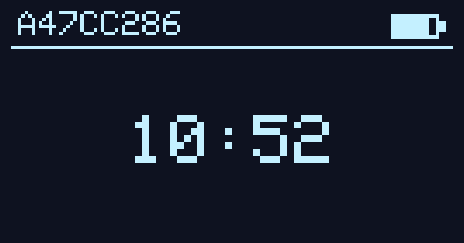
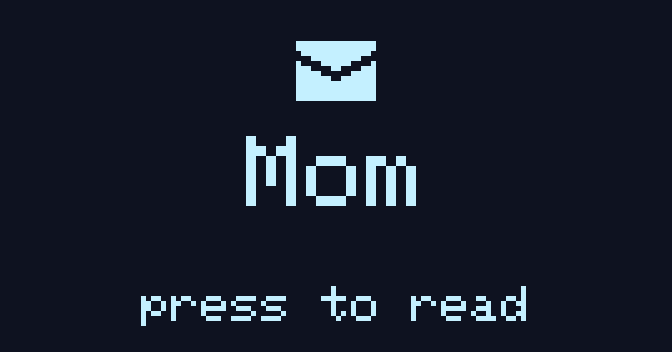
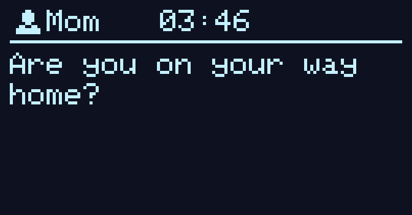
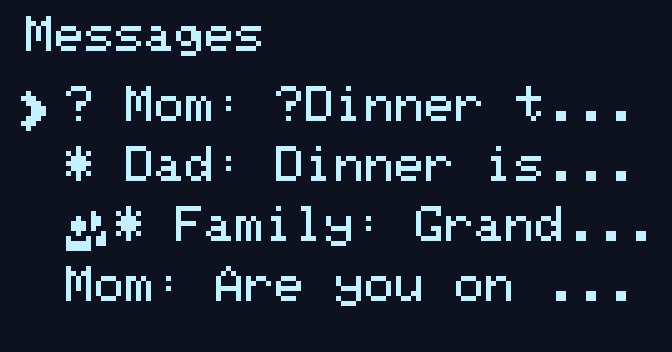
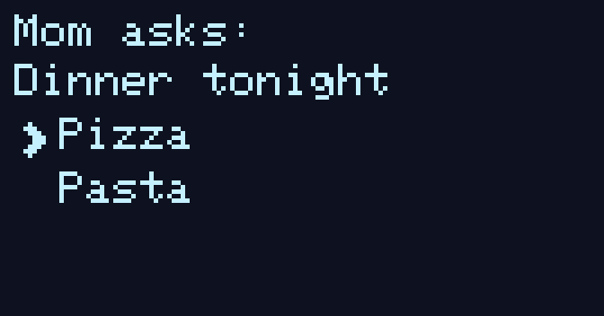
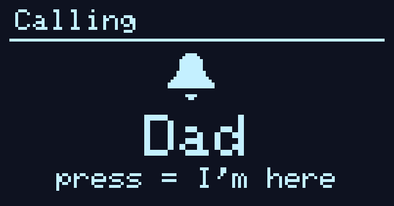
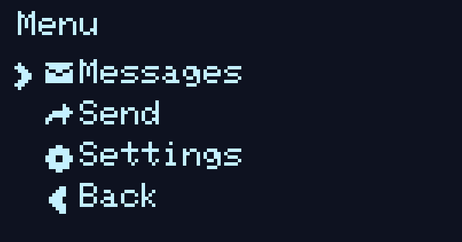
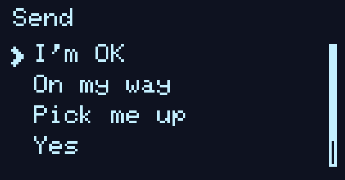

# MeshCore - Child Mode
<a href='https://ko-fi.com/W3V222VPDT' target='_blank'></a>

Child mode is a build of [MeshCore](https://github.com/meshcore-dev/MeshCore)'s companion radio for kids. I made it because we don't want to give our son a phone yet, but still want to reach him and know roughly where he is when he's out. A feature phone has no GPS; a smartphone is too much. This is the middle ground: one small LoRa device he can operate, doing messaging and location over the radio.

Everything child-specific is behind a `CHILD_MODE` compile flag, so a normal MeshCore build is byte-for-byte identical and we keep tracking upstream. For the mesh itself, see the [upstream repo](https://github.com/meshcore-dev/MeshCore) and [docs.meshcore.io](https://docs.meshcore.io).

Tested on the **Seeed Wio Tracker L1 Pro** (nRF52840, 128×64 OLED, joystick + back button). Other nRF52 + screen boards need their own variant but should be easy. I currently don't have another device to test.

## What the kid sees

A big clock and a battery icon. Press in for a short menu: read messages, send a quick reply. The full companion UI is compiled in but locked behind a PIN.

## Screenshots

<table>
  <tr>
    <td align="center"><br><b>Home</b><br>clock + battery</td>
    <td align="center"><br><b>New message</b><br>wakes the screen &amp; alerts</td>
    <td align="center"><br><b>Reader</b><br>scrollable message</td>
  </tr>
  <tr>
    <td align="center"><br><b>Inbox</b><br>unread &bull;, DM/group icons</td>
    <td align="center"><br><b>Question</b><br>pick an answer</td>
    <td align="center"><br><b>Call bell</b><br>“press = I’m here”</td>
  </tr>
  <tr>
    <td align="center"><br><b>Menu</b><br>messages · send · settings</td>
    <td align="center"><br><b>Send</b><br>pick a canned message</td>
    <td></td>
  </tr>
</table>

## What it does

- **Read messages.** DMs and group messages are stored on-device, scrollable, with unread markers and a wake-up notification. Opening one sends a read-receipt back (as a message).
- **Questions.** Send `?Dinner | Pizza | Pasta`; the kid picks an answer and it comes back to you. This is the most important feature for me personally.
- **Canned replies.** The kid picks from a short list you set ("I'm OK", "On my way"), chooses a recipient, sends.
- **Call bell.** Send a single 🔔 and the device rings and shows "Dad is calling". The kid presses a key, you get "👋 here" back.
- **Location and battery.** It's a real MeshCore node, so you can request the kid's position and battery from your phone. Enabled per-contact during setup.
- **No strangers.** Unknown nodes aren't auto-added, there's no public channel seeded, and stray adverts can't buzz the device. Only contacts you add can reach it.
- **Retries on its own.** Different from a stock companion radio. See [delivery](#delivery) below if you're interested. But the gist is, it tries harder to make sure packages arrive.

Controls are the same everywhere: up/down to move, right or press to choose, left or back to go back.

## Install

Grab the latest `WioTrackerL1_companion_radio_child-*.uf2` from [Releases](../../releases), then:

1. Plug the L1 into USB.
2. Double-tap reset. It mounts as a USB drive.
3. Drop the `.uf2` onto it. It reboots into child mode.

Or [build it yourself](#building-from-source).

## Setting it up (phone needed once)

The device only talks to contacts it knows, and adding them needs a phone — once. Connect the [MeshCore app](https://github.com/meshcore-dev/MeshCore#-meshcore-clients) to the kid's device over Bluetooth (unlock with the PIN, default `1234`), then:

1. Add each parent as a contact. This isn't automatic — pair each one so their key is stored on the device.
2. Allow location/telemetry requests from those contacts, or requesting the kid's position later won't work.

Add the kid as a contact on each parent's phone too. After that, everything runs over the radio.

## Commands (from a parent's phone)

Message the device to control it. These are handled silently — the kid never sees them:

| Command                    | What it does                                                                               |
| -------------------------- | ------------------------------------------------------------------------------------------ |
| `!pin <old> <new>`         | Change the lock PIN (default `1234`), e.g. `!pin 1234 4680`.                               |
| `!tz <minutes>`            | Clock UTC offset in minutes. Berlin summer `!tz 120`, winter `!tz 60`. No automatic DST.   |
| `!preset <n> <text>`       | Set canned-message slot _n_ (1–10), e.g. `!preset 1 I'm on my way`. Empty clears the slot. |
| `!name <newname>`          | Rename yourself on the kid's device (DM contact + group messages).                         |
| `!retry on` / `!retry off` | Turn on-device send retry on or off.                                                       |
| `?q \| a \| b`             | Ask a question, e.g. `?Dinner? \| Pizza \| Pasta`.                                         |
| 🔔                         | Rings the device and shows a "calling" screen.                                             |

Most of this works in a group channel too, but reliable delivery and location are DM-only. DM the kid when it matters.

## Using it (the kid)

- New message: screen lights up, press to read, up/down to scroll.
- Question: up/down to highlight, press to send.
- Send: menu → Send → pick a message → pick who. Shows "Sent"; a failed send stays put to retry.
- Call: press anything to answer, they get a "here".
- The PIN screen opens the full radio, for parents.

## Delivery

A stock companion radio leans on its tethered phone app to resend messages that don't arrive. The kid's device has no phone, so it does this itself: it holds each DM until the delivery ACK comes back, otherwise it resends with growing backoff. Overhearing any radio traffic nudges pending messages to resend sooner (rate-limited to every few seconds), and hearing the recipient's own advert triggers an immediate retry that re-floods to relearn the route.

Group messages have no ACK, so they aren't retried — prefer DMs. Turn it off with `!retry off`.

## Building from source

A PlatformIO project. With the repo cloned:

```bash
export FIRMWARE_VERSION=v1.7.6.0      # baked into the build
pio run -e WioTrackerL1_companion_radio_child -t upload
```

Debug build, which traces the retry/ack/flood logic over serial (115200):

```bash
pio run -e WioTrackerL1_companion_radio_child_debug -t upload
pio device monitor -e WioTrackerL1_companion_radio_child_debug
```

Package the `.uf2`/`.zip` like a release does:

```bash
export FIRMWARE_VERSION=v1.7.6.0
sh build.sh build-firmware WioTrackerL1_companion_radio_child   # lands in out/
```

### Releases and versioning

CI ([release-child-firmware.yml](.github/workflows/release-child-firmware.yml)) publishes a release on tag push:

```bash
git tag child-v1.7.6.123 && git push origin child-v1.7.6.123
```

Versions are `<meshcore version>.<our number>` — `1.7.6.123` is our build 123 on MeshCore 1.7.6. Tags are `child-v<version>`.

### Other boards and tests

Other boards and roles build as upstream; nothing here touches them. The plain build for this board is `WioTrackerL1_companion_radio_ble` (identical to upstream with `CHILD_MODE` off). `sh build.sh list` shows every environment.

Hardware-independent logic (config, commands, message store, retry queue, presets, questions, UI widgets) has host tests:

```bash
pio test --environment native --verbose
```

## AI Disclosure

It's mixed. I use AI a lot at work. Side projects are a way for me to keep my programming skills alive. This project contains a mix of manually written and AI generated (but manually reviewed) code. I used it more heavily in brainstorming ideas and discovering the original codebase. Don't use this if you're a purist.

## Credits

Built on [MeshCore](https://github.com/meshcore-dev/MeshCore) by Scott Powell (ripplebiz) and contributors — child mode is a thin layer on top, no extra dependencies, same MIT license. For the mesh itself: [MeshCore Discord](https://meshcore.gg) and [docs.meshcore.io](https://docs.meshcore.io).
